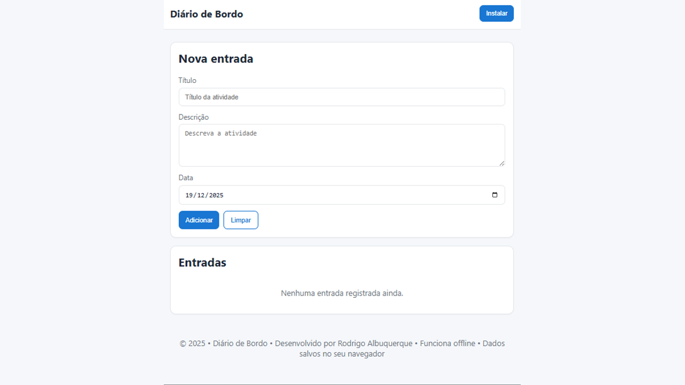
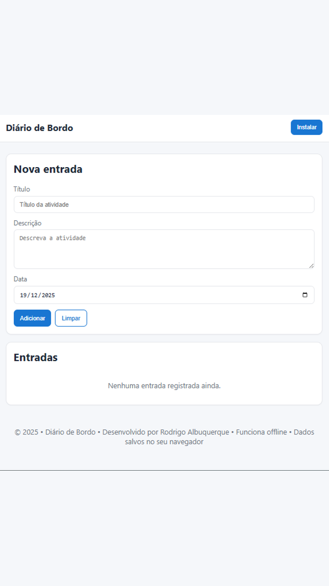

# Diário de Bordo · [diario-de-bordo-virid.vercel.app](https://diario-de-bordo-tawny.vercel.app/)

Aplicação web (PWA) simples para registrar entradas de um diário, com suporte a funcionamento offline via Service Worker e instalação como app.

## Propósito

- Todo mundo gosta de viajar, correto? Entâo, quem nunca teve necessidade de registrar e organizar atividades/entradas de forma simples, acessível e resiliente, inclusive sem conexão com a internet, e ainda com possibilidade de instalação como app para você utilizar no seu dispositivo móvel?
- Foi a partir dessa ideia que decidi criar uma PWA (Progressive Web Application) leve para cadastro, listagem e remoção de entradas, com persistência local e experiência de uso rápida.
- Implementado `index.html` + `style.css` + `script.js`; persistência via `localStorage`; suporte offline com `service-worker.js`; instalação configurada em `manifest.json`; scripts para geração de ícones (`generate-icons.js`) e screenshots (`generate-screenshots.js`).
- Como resultado, obtive uma aplicação que funciona offline, pode ser instalada, mantém dados no dispositivo do usuário, é fácil de publicar (estático) e tem recursos visuais padronizados para PWA.

## Tecnologias Utilizadas

- **HTML5/CSS3:** estrutura semântica, grid responsivo, variáveis CSS.
- **JavaScript (ES6+):** lógica de UI e dados sem frameworks.
- **Service Worker API:** cache e funcionamento offline.
- **Web App Manifest:** metadados de instalação (nome, ícones, cores).
- **Web Storage (`localStorage`):** persistência local das entradas.
- **Node.js 16+:** scripts utilitários de desenvolvimento.
- **Sharp:** geração automática de ícones em múltiplos tamanhos.
- **http-server / Live Server:** servidor estático para desenvolvimento.
- **VS Code:** ambiente de edição e extensões auxiliares.

## Visão Geral

- Página principal: `index.html`
- Estilos: `style.css`
- Lógica: `script.js`
- PWA: `manifest.json` e `service-worker.js`
- Ícones: pasta `icons/` e script `generate-icons.js` (usa Sharp)
- Screenshots: pasta `screenshots/`

## Requisitos

- Node.js 16+ (apenas para gerar ícones com Sharp)
- VS Code (opcional) com Live Server ou qualquer servidor estático

## Instalação

```bash
npm install
```

npm run generate:icons

````

Observação: ajuste o script conforme necessário para sua imagem base de ícone (por exemplo, caminho do arquivo de origem e tamanhos desejados).

## Executar Localmente

- Opção 1 (VS Code): instale a extensão Live Server e abra `index.html`.
- Opção 2 (via npx):


Padrões do projeto:
- Origem padrão: `icons/icon-512.svg`
- Saídas geradas: `icons/icon-192.png` e `icons/icon-512.png`
```bash
npx http-server . -p 5500
````

Então acesse: http://localhost:5500/

## Funcionalidades PWA

Padrões do projeto:

- Saídas geradas: `screenshots/desktop-wide-1280x720.png` e `screenshots/mobile-narrow-720x1280.png`
- `manifest.json`: define nome, cores e ícones para instalação.
- `service-worker.js`: habilita cache e funcionamento offline. Ao servir o site via HTTP(s), o service worker será registrado e a app pode ser instalada.

## Screenshots recomendadas (PWA)

generate-screenshots.js

- Desktop (wide): 1280x720 (arquivo: `screenshots/desktop-wide-1280x720.png`)
- Mobile (narrow): 720x1280 (arquivo: `screenshots/mobile-narrow-720x1280.png`)

### Gerar automaticamente

```bash
npm run generate:screenshots
```

## Persistência de dados

- As entradas do diário são salvas no `localStorage` do navegador.
- Limpar dados do navegador ou usar modo privado pode remover as entradas.
- Não há backend; os dados ficam 100% no seu dispositivo.
  O script usa estritamente a imagem de origem `screenshots/diario-de-bordo-2025-12-19.png`. Se não existir, a execução falha com instruções para criar/renomear a imagem. O `manifest.json` referencia os arquivos gerados com `form_factor` adequado.

## Estrutura

### Notas sobre cache

- Evite nomes de arquivos com espaços. O service worker deliberadamente ignora recursos cujo caminho contenha espaços para evitar problemas de cache.
  generate-icons.js
  index.html
  manifest.json
  package.json
  script.js
  service-worker.js
  style.css
  icons/
  screenshots/

```

## Deploy

Por ser um site estático, pode ser publicado em:

- GitHub Pages
- Netlify
- Vercel

Exemplo (GitHub Pages):

1. Faça commit e push do repositório.
2. Ative Pages no repositório (branch `main` ou pasta `docs`).
3. Acesse a URL gerada e verifique a instalação PWA.

## Licença

Este projeto usa a licença ISC (ver `package.json`).
```

## Screenshots

Abaixo temos três prints da aplicação:





## Aprendizados Técnicos

- **PWA na prática:** configuração de `manifest.json` (nome, cores, ícones) e registro de `service-worker.js` para suporte offline e instalação como app.
- **Ciclo de vida do Service Worker:** uso de `updatefound`, `installed`, `waiting` e `controllerchange` para detectar novas versões e acionar recarga controlada (estratégia de atualização automática).
- **Cache e resiliência:** cache de recursos estáticos e regra explícita para evitar arquivos com espaços no caminho, reduzindo problemas de cache.
- **Instalação (A2HS):** manipulação do `beforeinstallprompt` com `deferredPrompt`, tratamento de `prompt()`/`userChoice` e controle de visibilidade do botão de instalar.
- **Persistência local:** CRUD (Create, Read, Update, Delete) simples com `localStorage`, modelo de dados enxuto e prevenção básica de XSS via `escapeHtml()` nas entradas renderizadas.
- **Formatação de datas:** formatação regional com `toLocaleDateString('pt-BR', { timeZone: 'UTC' })` e definição de data padrão.
- **UI responsiva e acessível:** grid responsivo, variáveis CSS (tokens de design), `position: sticky` no cabeçalho, labels semânticos e foco em legibilidade.
- **Ícones e screenshots:** automação com Sharp (`generate-icons.js`) para exportar tamanhos PWA e script de screenshots (`generate-screenshots.js`) nos formatos recomendados.
- **Publicação estática:** execução local via servidor estático (`http-server`) e preparo para deploy em GitHub Pages/Netlify/Vercel.

- ## 🤝 Contribuições

Contribuições são bem-vindas! Agradeço desde já. Sinta-se à vontade para:

1. **Fork** o projeto
2. **Crie** uma feature branch
3. **Faça commit** das mudanças
4. **Abra** um Pull Request
